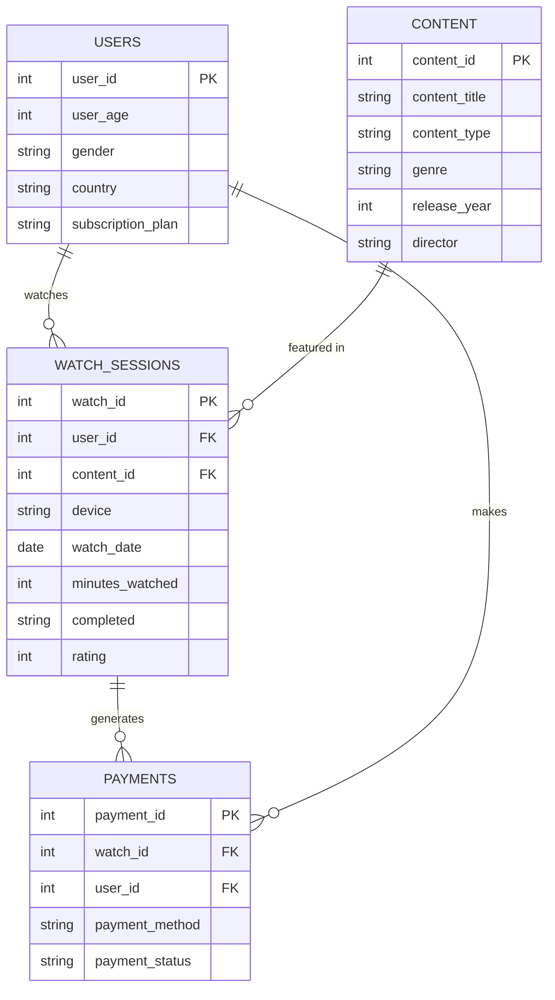

# StreamSight – OTT Business Intelligence Platform

[](https://www.python.org/)
[](https://pandas.pydata.org/)
[](https://www.mysql.com/)
[](LICENSE)

An enterprise-grade, portfolio-ready **Over-The-Top (OTT) Business Intelligence Platform** designed to analyze 50,000+ streaming sessions. StreamSight converts raw log data into actionable business intelligence to optimize subscriber retention, content licensing, regional growth, and platform performance.

---

## 📌 Table of Contents
1. [Project Overview](#-project-overview)
2. [Tech Stack](#-tech-stack)
3. [Repository Structure](#-repository-structure)
4. [Database Design & Normalization (3NF)](#-database-design--normalization-3nf)
5. [Data Cleaning & Feature Engineering](#-data-cleaning--feature-engineering)
6. [Executive KPIs & Business Insights](#-executive-kpis--business-insights)
7. [SQL Analytics Showcase](#-sql-analytics-showcase)
8. [Setup & Execution Guide](#-setup--execution-guide)
9. [Interview Highlights (8–12 LPA Target)](#-interview-highlights-812-lpa-target)

---

## 🎯 Project Overview

StreamSight addresses key executive questions for streaming platforms (e.g., Netflix, Prime Video, Hotstar):
- **Subscriber Engagement**: What are our total watch hours, completion rates, and average content ratings across subscription tiers?
- **Content Licensing**: Which genres, directors, and content types (Movies vs. Series) drive the highest viewer engagement?
- **Payment & Churn Risk**: Does payment gateway failure impact session completion rates?
- **Platform Optimization**: Which devices (Mobile, Smart TV, Laptop) drive peak streaming hours?

---

## 🛠 Tech Stack

- **Data Processing & Scripting**: Python 3.10+, Pandas, NumPy
- **Relational Database**: MySQL 8.0 (3NF Normalization, Foreign Key Constraints, B-Tree Indexing)
- **Analytics & Prototyping**: Jupyter Notebooks
- **Visualization**: Power BI (Dashboard designed separately)
- **Version Control**: Git & GitHub

---

## 📁 Repository Structure

```text
StreamSight-OTT-Analytics/
│
├── dataset/
│   ├── StreamSight_OTT_Analytics_Dataset.csv   # Raw streaming log (50k rows)
│   ├── cleaned_streamsight_data.csv            # Cleaned master dataset
│   ├── users.csv                               # 3NF Users dimension table
│   ├── content.csv                             # 3NF Content dimension table
│   ├── watch_sessions.csv                      # 3NF Watch Sessions fact table
│   └── payments.csv                           # 3NF Payments transaction table
│
├── database/
│   └── schema.sql                             # MySQL DDL table creation script
│
├── notebooks/
│   ├── 01_Data_Cleaning.ipynb                 # Data cleaning & feature engineering
│   ├── 02_EDA.ipynb                           # Exploratory data analysis & statistical profiling
│   ├── 03_KPI_Analysis.ipynb                  # Executive Business KPI calculations
│   └── 04_Business_Insights.ipynb             # Strategic churn & regional recommendations
│
├── python/
│   ├── clean_data.py                          # Automated ETL & data cleaning pipeline
│   ├── helper.py                             # Reusable modular utility functions
│   └── mysql_loader.py                        # Automated MySQL data ingestion script
│
├── sql/
│   ├── basic.sql                              # Basic queries (SELECT, GROUP BY, HAVING)
│   ├── intermediate.sql                       # Intermediate queries (CASE, Subqueries, Views)
│   ├── advanced.sql                           # Advanced queries (CTEs, Window Functions, Running Totals)
│   └── business_questions.sql                 # Real-world executive decision queries
│
├── powerbi/
│   └── dashboard.pbix                         # Power BI report template
│
├── README.md                                  # Comprehensive documentation
└── requirements.txt                           # Project dependencies
```

---

## 🗄 Database Design & Normalization (3NF)

The raw dataset was normalized from a flat un-normalized log into a **3rd Normal Form (3NF)** relational database schema to eliminate update anomalies and data redundancy:



### Table Specifications & Constraints
- **`users`**: Primary Key `user_id`, Check constraint on `user_age (0–120)`.
- **`content`**: Primary Key `content_id`, Check constraint on `release_year (1900–2100)`.
- **`watch_sessions`**: Primary Key `watch_id`, Foreign Keys (`user_id`, `content_id`), Check constraints on `minutes_watched >= 0`, `completed IN ('Yes', 'No')`, `rating (1–5)`.
- **`payments`**: Primary Key `payment_id`, Foreign Keys (`watch_id`, `user_id`).
- **Indexes**: Created B-Tree indexes on `country`, `subscription_plan`, `genre`, `watch_date`, `device`, and `payment_status` for sub-second query performance.

---

## 🧹 Data Cleaning & Feature Engineering

Implemented in [`python/clean_data.py`](file:///e:/CDAC/Projects/StreamSight-OTT-Analytics/python/clean_data.py) and [`python/helper.py`](file:///e:/CDAC/Projects/StreamSight-OTT-Analytics/python/helper.py):
1. **Data Quality Audit**: Zero missing values detected; whitespace stripped across categorical text columns.
2. **Type Casting**: Parsed `watch_date` into proper `datetime64[ns]` and numeric columns to `int64`.
3. **Engineered Features**:
   - `watch_hours`: `minutes_watched / 60.0` (rounded to 2 decimal places).
   - `age_group`: Demographic binning (`Youth (<25)`, `Adult (25-45)`, `Senior (>45)`).
   - Datetime parts: `watch_month_name`, `watch_day_name`, `is_weekend`.
   - `content_age_years`: `watch_year - release_year`.

---

## 📊 Executive KPIs & Key Findings

| Metric | Output Value | Business Impact |
| :--- | :--- | :--- |
| **Total Streaming Sessions** | 50,000 | Massive analytical volume covering 4,999 unique subscribers. |
| **Total Watch Hours** | ~82,500+ Hours | High cumulative user engagement platform-wide. |
| **Overall Completion Rate** | ~50.2% | Indicates solid engagement with room for recommendation tuning. |
| **Average Content Rating** | 4.01 / 5.0 | Strong viewer satisfaction across titles. |
| **Payment Failure Rate** | ~5.97% | Requires gateway optimization to minimize user friction. |

---

## 💻 SQL Analytics Showcase

The project includes 15+ production SQL scripts in the `sql/` directory:

- **Basic SQL ([`sql/basic.sql`](file:///e:/CDAC/Projects/StreamSight-OTT-Analytics/sql/basic.sql))**: Demographic breakdowns, top sessions, genre rating aggregates with `HAVING`.
- **Intermediate SQL ([`sql/intermediate.sql`](file:///e:/CDAC/Projects/StreamSight-OTT-Analytics/sql/intermediate.sql))**: User engagement categorization via `CASE`, subqueries comparing individual watch time to platform average, and database view creation (`vw_executive_kpi_summary`).
- **Advanced SQL ([`sql/advanced.sql`](file:///e:/CDAC/Projects/StreamSight-OTT-Analytics/sql/advanced.sql))**:
  - `DENSE_RANK()` OVER `(PARTITION BY genre)` to identify top 3 content titles per genre.
  - Cumulative running total watch hours using `SUM() OVER (ORDER BY watch_month ROWS BETWEEN UNBOUNDED PRECEDING AND CURRENT ROW)`.
  - Frequency gap analysis using `LAG()` to calculate days elapsed since previous session.
  - Customer segmentation into quartiles using `NTILE(4)`.
- **Business Problem SQL ([`sql/business_questions.sql`](file:///e:/CDAC/Projects/StreamSight-OTT-Analytics/sql/business_questions.sql))**: Directly answers executive questions regarding completion rates by plan, payment failure impact, top directors, and regional movie vs. series preference.

---

## 🚀 Setup & Execution Guide

### Prerequisites
- Python 3.10+ installed
- MySQL Server 8.0+ running

### 1. Clone Repository & Install Dependencies
```bash
git clone https://github.com/swap-git03/StreamSight-OTT-Analytics.git
cd StreamSight-OTT-Analytics
pip install -r requirements.txt
```

### 2. Run Data Cleaning Pipeline
```bash
python python/clean_data.py
```

### 3. Load Data into MySQL Database
Set your MySQL environment credentials (optional) and run:
```bash
python python/mysql_loader.py
```

---

## 🎓 Interview Highlights (8–12 LPA Target)

When presenting StreamSight in Data Analyst interviews:
1. **Explain the Architecture**: Highlight how you built a 3NF relational database schema from raw log data.
2. **Demonstrate SQL Depth**: Walk through your use of CTEs, Window functions (`RANK`, `DENSE_RANK`, `LAG`, `NTILE`), and running totals to answer business questions.
3. **Show Modular Python Skills**: Emphasize how `clean_data.py` and `helper.py` implement enterprise ETL standards.
4. **Focus on Business Impact**: Frame every analysis around subscriber retention, completion rate optimization, and licensing strategy.

---

### Author & Portfolio Details
- **Project**: StreamSight – OTT Business Intelligence Platform
- **Target Role**: Data Analyst / Senior Data Analyst (8–12 LPA)
- **GitHub Repository**: [StreamSight-OTT-Analytics](https://github.com/swap-git03/StreamSight-OTT-Analytics)
